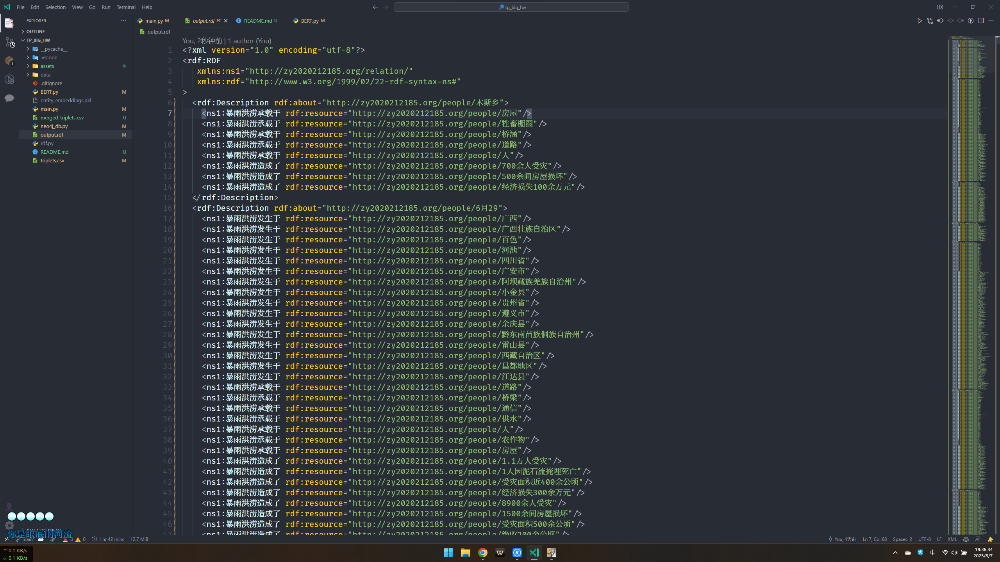

# 知识图谱作业三


[TOC]

> 构建面向暴雨洪涝灾情的知识图谱，具体内容包括：
> 
> （1）暴雨洪涝灾情文本的预处理
> 通过爬虫，从中国新闻网、澎湃新闻等网站爬取有关暴雨洪涝灾情的新闻文本或者利用已给的暴雨洪涝灾情文本，然后对其进行去重、删除无用符号等一系列预处理。
> 
> （2）暴雨洪涝灾情文本的语料库的构建
> 利用已经人工标注的暴雨洪涝灾情文本整合为语料库。
> 
> （3）实体和关系的抽取
> 基于语料库利用机器学习或深度学习的相关模型实现实体（如时间、地点、经济损失等）和关系（发生于、发生在等）的抽取。
> 
> （4）实体的对齐
> 利用相似度计算等方法实现实体的对齐。
> 
> （5）暴雨洪涝灾情知识库的构建
> 转换为RDF格式数据，构建暴雨洪涝灾情的知识库。
> 
> （6）暴雨洪涝灾情知识图谱的存储
> 利用Neo4j图数据库实现暴雨洪涝灾情知识图谱的存储。
> 
> （7）暴雨洪涝灾情知识图谱的可视化
> 利用Python语言框架Django和Echarts实现知识图谱可视化。
> 
> 作业要求：
> 
> （1）提交暴雨洪涝灾情知识图谱的设计和实现文档：包括需求分析、总体设计、各个功能的详细设计和实现、各个功能测试等。
> 
> （2）提交源代码：源代码请附加Readme文件说明使用的主要包的版本，以及其他可能影响代码运行的事项。
> 

## 一、文本预处理

这部分的主要任务是读取文本，生成文本和其对应标签的列表。


`process_text`主要是用来处理原始文本，其中涉及到实体识别和清理工作。其整体步骤如下：

1. 首先，删除了原始文本中的换行符，并将文本转换成字符列表。

2. 其次，搜索文本中与给定正则表达式模式匹配的所有实体。每当找到一个匹配项时，代码就会更新`tags`列表，为实体的第一个字符赋予"B"（开始）标签，为其余字符赋予"I"（内部）标签。

3. 然后，代码会删除那些在`disallowed_chars`列表中的字符，并相应地删除这些字符的标签。

4. 最后，它会删除所有的空格字符和相应的标签。

以上所有步骤完成后，这段代码会断言字符列表和标签列表的长度是否相等，确保每个字符都有一个对应的标签。然后，它会返回这两个列表。

传递给这个函数的参数有以下几个：
- `raw_text`：待处理的原始文本。
- `pattern`：用于匹配地理位置实体的正则表达式。
- `B_label`：用于标记实体开始的标签。
- `I_label`：用于标记实体内部的标签。
- `disallowed_chars`：需要被删除的字符列表。


`transform_data`函数的作用是读取某个文件夹下的所有文件，并将这些文件的文本内容进行处理。具体步骤如下：

1. 首先，它会创建一个空列表`data`用于存放每个文件处理后的数据。

2. 然后，它会使用`os.listdir()`函数获取给定文件夹下的所有文件名。

3. 接着，它会遍历每个文件，使用`open()`函数打开文件并读取文件内容，然后使用`process_text()`函数处理读取到的文本。这个处理过程会根据给定的正则表达式匹配和标记实体，并删除不需要的字符。处理后的数据会被添加到`data`列表中。

4. 最后，函数返回处理后的数据列表和文件名列表。

该函数的输入参数有：

- `folder_path`：文件夹路径，这个文件夹下的所有文件都会被处理。
- `regex`：用于匹配实体标注的正则表达式。
- `B_label`：用于标记实体开始的标签。
- `I_label`：用于标记实体内部的标签。
- `disallowed_chars`：需要被删除的字符列表。

分别处理四类数据：

```python
data_loaction, title_loc = transform_data("./data/location", r' ([^ ]+)/LOC ', "B-LOCATION", "I-LOCATION", ["/", "L", "O", "C"])
data_time, title_time = transform_data("./data/time", r' ([^ ]+)/[DT][SO] ', "B-TIME", "I-TIME", ["/", "D", "T", "S", "O"])
data_lost, title_lost = transform_data("./data/lost", r' ([^ ]+)/DB ', "B-LOST", "I-LOST",["/", "D", "B"])
data_person, title_person = transform_data("./data/person", r' ([^ ]+)/\b(AE|AImP|ADP|AMP|AInP|AIAC|ATAC|AHC|AIAC2)\b ', "B-PERSON", "I-PERSON", ["/", "A", "E", "P", "I", "M", "T", "H", "C", "2"])
```

输出示例如下


## 二、实体提取

现在已经有了以字符和标签的形式存在的数据，即每个数据元素都是一个元组，元组的第一个元素是字符列表，第二个元素是与字符对应的标签列表。


函数`extract_info_with_title`的目的是从标注过的数据中提取出**实体**，然后将这些信息与**对应的标题组合起来**。具体步骤如下：

1. 首先，定义了一个名为`extract_info`的内部函数，该函数通过遍历每个数据元素的标签部分，当发现一个元素的标签是`B_label`时，就开始收集一个新的结果，并添加对应的字符；当发现一个元素的标签是`I_label`时，就继续添加对应的字符，将其添加到最近的结果中。

2. 然后，这段代码调用`extract_info`函数，提取出对应类型的信息，并存储在`results`列表中。

3. 接着，遍历`results`列表，将每个结果与对应的标题组合起来，存储在`results_with_title`列表中。

4. 最后，返回`results_with_title`列表。

- `locations_with_title`提取出的是标注为"B-LOCATION"和"I-LOCATION"的位置信息，与其对应的标题。
- `times_with_title`提取出的是标注为"B-TIME"和"I-TIME"的时间信息，与其对应的标题。
- `losts_with_title`提取出的是标注为"B-LOST"和"I-LOST"的丢失信息，与其对应的标题。
- `persons_with_title`提取出的是标注为"B-PERSON"和"I-PERSON"的人物信息，与其对应的标题。

运行效果如下：


## 三、关系提取


这一部分的主要目的是对已经标注过的数据进行进一步的处理，将地点、时间、损失和人物等信息汇总到一起，**如果它们是一样的标题就认为他们是有关系的**。然后在每个标题下去除重复的实体。以下是具体步骤：

1. `process_entity_list`函数接收三个参数：`entity_list`是一个包含实体和标题的列表；`entity_index`表示实体应该放在五元组的哪个位置；`title_dict`是一个字典，键是标题，值是五元组（地点、时间、损失、人物、标题）。对于`entity_list`中的每个元素（实体和标题），函数会检查该标题是否已经存在于`title_dict`字典中。如果不存在，就在字典中添加一个新条目，键是标题，值是一个空的五元组。然后，函数会在当前的五元组中的指定位置添加实体，生成一个新的五元组，并用这个新的五元组替换字典中原有的五元组。最后，函数返回更新后的`title_dict`字典。

2. `remove_duplicates`函数是一个简单的辅助函数，它接收一个列表作为输入，然后返回一个新的列表，其中删除了所有重复的元素。

3. 接下来的代码就是调用`process_entity_list`函数，将地点、时间、损失和人物的列表处理成字典形式，每个标题对应一个五元组。

4. 最后，`tuple_list`列表是由字典的值（五元组）组成的。这个列表包含了所有的数据，其中每个数据元素都是一个五元组，包含了地点、时间、损失、人物和标题。

主要逻辑是将实体按照标题分组。这种处理方式使得后续可以方便地根据标题获取对应的地点、时间、损失和人物信息。

### 实体去重


这一段是每个五元组（地点、时间、损失、人物、标题）中实体列表的去重操作。具体步骤如下：

1. 使用`process_entity_list`函数将每种实体（地点、时间、损失、人物）的列表处理为字典形式，每个标题对应一个五元组。

2. 然后，将字典转化为列表，其中每个元素是一个五元组。

3. 接下来，遍历这个五元组的列表，对每个五元组中的实体列表进行去重操作。去重操作是使用`remove_duplicates`函数实现的，该函数会删除列表中的重复元素。

4. 最后，打印出第151个五元组。这个五元组包含了地点、时间、损失、人物信息和对应的标题，每种实体的列表都已经去重。

这段代码的主要作用是对之前提取出的实体进行去重操作，这样可以避免处理重复的信息。同时，它也将所有的数据整理为一个五元组的列表，方便后续的处理和使用。

运行效果如下：


## 四、生成三元组


`generate_tuples`函数的目标是从五元组列表中生成一系列的三元组，每个三元组包括一个实体、一个关系和另一个实体。以下是具体步骤：

1. 初始化一个空列表`triplets`用于存储生成的三元组。

2. 遍历五元组列表`tuple_list`，每个元组包含地点、时间、损失、人物和标题。

3. 对于每一个标题，去除尾部的'.txt'后缀，并加上尖括号。然后将标题设置为'暴雨洪涝'。

4. 对于每个地点，生成三个类型的三元组：（地点，'暴雨洪涝发生于'，损失），（地点，'暴雨洪涝发生于'，人物）。

5. 对于每个时间，生成三个类型的三元组：（时间，'暴雨洪涝发生于'，地点），（时间，'暴雨洪涝承载于'，损失），（时间，'暴雨洪涝造成了'，人物）。

6. 返回生成的三元组列表`triplets`。

在这段代码中，五元组列表中的每一个五元组可以生成多个三元组，因此最后生成的三元组列表`triplets`的长度会远大于输入的五元组列表`tuple_list`。

然后，这段代码输出了第151个三元组。三元组是知识图谱中的基本组成单位，每个三元组代表一个关系，包括两个实体和一个关系。


## 五、保存到csv并查询实体数量


这段代码的主要作用是将生成的三元组保存到csv文件中，并查询实体的数量。以下是具体步骤：

1. 使用Python的`csv`库，打开一个名为`triplets.csv`的文件，并创建一个CSV写入器`writer`。

2. 使用`writer.writerow`函数，首先写入列名"subject", "relation", "object"。

3. 遍历三元组列表`triplets`，将每个三元组写入CSV文件中。

4. 接下来创建一个空的集合`entities`，用于存储所有出现过的实体。集合是一个不包含重复元素的数据结构，所以添加实体到集合时，重复的实体会被自动忽略。

5. 遍历三元组列表，将每个三元组的主体（subject）和对象（object）添加到`entities`集合中。

6. 计算并打印实体的数量。这是通过调用Python的`len`函数来计算集合的大小实现的。因为集合中不包含重复的元素，所以这个大小就是所有不同实体的数量。

这段代码的结果是生成一个CSV文件，其中包含了所有的三元组，以及一个实体数量的统计结果。

运行效果如下：


## 六、实体对齐

### 6.1 加载BERT模型


使用transformers库（由Hugging Face开发，专为自然语言处理任务设计）加载预训练的BERT模型和对应的分词器。

BERT（Bidirectional Encoder Representations from Transformers）是一种预训练的深度学习模型，被广泛应用于各种自然语言处理任务。预训练模型是指在大规模语料库上训练好的模型，这样在进行具体任务（如文本分类、命名实体识别等）时，只需要在此基础上进行微调即可，大大节省了计算资源和时间。

这里使用的是英文的bert-base-uncased模型，这是一个小型的BERT模型（12层、768个隐藏层节点、110M参数），并且在训练时对所有英文字母进行了小写处理。

首先，使用`BertTokenizer.from_pretrained('bert-base-uncased')`加载预训练的BERT分词器。分词器是用于将输入的文本数据转换为模型可以理解的形式（通常是整数序列）。然后，使用`BertModel.from_pretrained('bert-base-uncased')`加载预训练的BERT模型。

### 6.2 计算实体相似度


我定义了三个函数，用于计算两个实体在BERT模型中的相似度。

1. `get_bert_input(entity)`函数使用BERT分词器（tokenizer）将实体转换为模型输入。这包括将实体文本分词、转换为模型可识别的数字ID，以及添加必要的特殊标记（例如CLS和SEP）。函数还限制了输入的最大长度，并将超出的部分截断。

2. `get_entity_embedding(entity, model)`函数将实体文本转换为BERT向量表示。这是通过向模型输入文本并提取出最后一层的[CLS]标记的隐藏状态完成的。在BERT模型中，[CLS]标记的隐藏状态被设计为捕获整个输入序列的表示，所以常常被用作整个句子或者实体的向量表示。

3. `calculate_similarity(entity1, entity2, model)`函数计算两个实体在BERT模型中的相似度。这是通过首先获取两个实体的向量表示，然后计算这两个向量之间的余弦相似度来实现的。余弦相似度是一种常见的计算向量相似度的方法，它的值介于-1和1之间，1表示两个向量完全相同，-1表示两个向量完全不同。

这段代码的最后部分展示了如何使用`calculate_similarity`函数来计算两个实体的相似度。

一个例子是这里的实体分别是"Apple"和"苹果"，虽然一个是英文，一个是中文，但因为它们具有相同的含义，所以在理想情况下，它们在模型中的相似度应该很高。

运行效果如下：


### 6.3 寻找并合并相似的实体


这部分主要做的是从已有的实体关系三元组数据中寻找并合并相似的实体。具体工作流程如下：

1. **导入库和加载数据**： 
   首先，导入了pandas库，用于数据处理和分析。接着，使用pandas的read_csv函数读取名为'triplets.csv'的CSV文件，这个文件包含了一系列的实体关系三元组。

2. **收集唯一实体**：
   在数据加载之后，通过将主体和对象字段合并，并转化为集合，得到所有出现过的唯一实体。随后，它会打印出这些唯一实体的总数。进一步的，为了限制实体对的数量，这段代码还随机抽取了1000个唯一实体进行后续处理。

3. **生成实体对**：
   定义了一个函数`generate_entity_pairs`，这个函数将所有唯一实体进行两两配对，生成一个包含所有可能实体对的列表。然后，打印出这个列表中实体对的数量。

4. **寻找和合并相似实体**：
   在创建了所有可能的实体对后，代码遍历这些实体对，并检查是否存在相似的实体。这里的“相似”有两个条件：**一是一个实体是另一个实体的子字符串，二是两个实体的BERT向量表示的余弦相似度大于0.7。**如果满足任何一个条件，就认为这两个实体是相似的，需要进行合并。在合并过程中，选择保留字较少的实体，并用它来替换字较多的实体。这个过程用一个字典来完成，字典的键是被替换的实体，字典的值是用于替换的实体。

5. **更新实体三元组数据**：
   为了在原始数据上应用这些实体的替换，代码首先创建了一个原始数据框的副本。然后，对副本进行迭代，检查每一行的主体和对象字段。如果这些字段中的任何一个实体出现在`merged_entities`字典的键中，那么就用字典中相应的值替换这个实体。经过这个步骤后，所有相似的实体都被合并为一个。

6. **查看更新后的唯一实体数量**：
   进行完上述操作后，再次提取主体和对象字段中的唯一实体，并打印其数量，以查看实体合并后的结果。

7. **保存更新后的数据**：
   最后一步是将更新后的实体关系三元组数据保存为新的CSV文件，文件名为`'merged_triplets.csv'`。这个新的文件可以直接用于后续的数据分析或机器学习任务。

总的来说，目标是通过找到并合并相似的实体，来简化实体关系数据集。这个过程可以减少实体的数量，提高数据的一致性，也便于后续的数据处理和分析。

运行效果如下：


## 七、转换为RDF格式数据


这部分的主要任务是将CSV文件中的实体关系数据转换为RDF（资源描述框架）格式，具体步骤如下：

1. **设置命名空间和初始化图**：使用rdflib库中的Namespace类创建一个命名空间n，所有的实体将在这个命名空间下。然后使用Graph类创建一个空的RDF图。

2. **读取和处理CSV文件**：通过内置的csv库打开并读取CSV文件。csv.reader返回一个迭代器，用于按行读取CSV文件。使用next(csv_reader)跳过CSV文件的头行（列名）。然后遍历CSV文件的每一行，对于每一行数据，都将其分解为主体（subject），关系（relation）和对象（object）。

3. **生成URI和添加三元组**：对于每一行数据，使用命名空间n和主体或对象的字符串生成URI。然后以关系字符串创建谓词URI。接着，使用Graph的add方法添加一个三元组到RDF图中，三元组由主体URI，谓词URI和对象URI组成。

4. **序列化和保存RDF图**：最后，使用Graph的serialize方法将RDF图序列化为RDF/XML格式的数据，并写入名为'output.rdf'的文件中。

总结起来，这段代码从CSV文件读取实体关系数据，转换为RDF格式，并保存为一个RDF/XML文件，以便于在语义网或其他需要RDF数据的应用中使用。

运行效果如下：



## 八、利用Neo4j图数据库实现暴雨洪涝灾情知识图谱的存储和可视化


这部分的目标是将CSV文件中的三元组数据（主体，关系，对象）导入到Neo4j图形数据库中。

以下是主要步骤：

1. **连接到Neo4j数据库**：首先，定义了Neo4j数据库的URI，并使用该URI以及用户名和密码创建一个`GraphDatabase`驱动器。这个驱动器用于与Neo4j数据库进行交互。

2. **读取CSV文件**：使用pandas的`read_csv`函数读取CSV文件，该文件包含了要导入到Neo4j的数据。数据被读取为pandas DataFrame对象。

3. **定义添加数据的函数**：定义了一个名为`add_data`的函数，该函数在Neo4j事务中运行一个Cypher查询。该查询分为三个部分：第一部分，使用`MERGE`语句创建或找到具有指定名称的节点`e1`；第二部分，使用另一个`MERGE`语句创建或找到具有指定名称的节点`e2`；第三部分，使用最后一个`MERGE`语句创建或找到一个名为`RELATIONSHIP`且具有指定名称的关系，该关系从`e1`指向`e2`。

4. **执行添加数据的函数**：在数据库会话中，遍历pandas DataFrame的每一行。对于每一行，都会执行`add_data`函数，使用行中的'subject'、'relation'和'object'列作为参数。

5. **关闭数据库连接**：最后，关闭与Neo4j数据库的连接。

运行效果如下:


